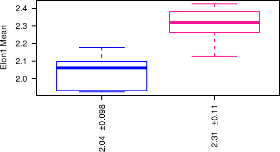

# Batch analyze treatment effect:

Let us recall that several pdfs are produced: by filtering the acceptable structures with:

_no filter (with the prefix size0) / size above size threshold (see below) / above 2*size threshold / above 4*size threshold / quality above quality threshold and size above size threshold / structures with lumen and size above size threshold._

The size threshold is for the volume and is in the same unit than the scale of the image (typically in µm which leads then to µm³). It is set in SAMA analyze with a default value of 500.

For every image, there are several structures which can be summarized by taking either the mean value for each quantity, the coefficient of variation (standard deviation/ mean), standard deviation or the median. Every pdf uses all these methods successively.

For every quantity, the population of replicates is plotted as an estimation of a distribution and as a boxplot. Under the first graph, the quantity plotted is given, here Elon1, then the function in order to go from all the structures in one replicate to one point (here the mean), then the p-value is given for an ANOVA and for the Wilcoxon rank test (when there is only two treatments). Under the boxplot, the average and standard deviation of every Treatment is given.

{.centerBlock}

The graph include also a PCA analysis, based on the factominR package for R. This include a plot of the similarity betweeen the two first dimension of the PCA, and of the original quantity, a scatterplot of the replicates on these dimensions and an automatic clustering based on the 4 first dimensions of the PCA.

Also, the 5 first dimensions are displayed like the original quantities as dim.1 to dim.5.

# Analyze reproducibility:

The reproducibility analysis produces similar plot than above but where the experiment number takes the place of the treatment in the analysis and instead of the mean for each replicate, all structures are taken into account.

Moreover, a pdf called distribution plots the distribution of the structures for every replicate, in order to check their shape and their stability. Comparisons are performed between replicates in the same conditions. P-values are obtained by ANOVA, and check the significance of the plate (experiment) number and of the well (replicate) number. Note that unlike above the comparison is performed at the level of the whole population of structures, not at the level of the replicates, which means that small differences will be significant.
